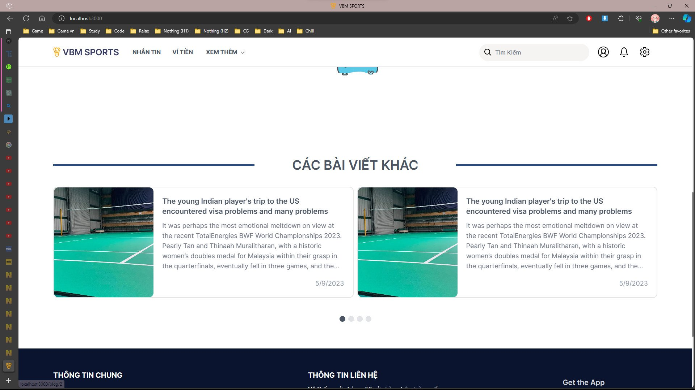
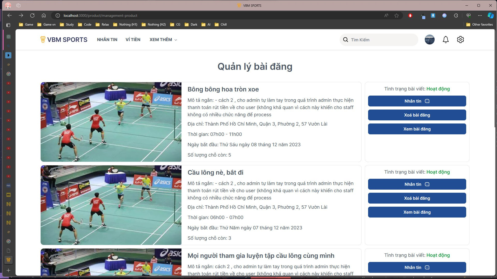

# ``Dev-Test`` Branch - Local Environment Setup

## This is the ``dev-test`` branch. To run the project locally:

1. First, clone the backend repository from [here](https://github.com/taiduong1314/BadmintonMatchingPlayer).
   
2. Make sure to make necessary adjustments in the backend to match your local environment:
    - Update the user and password in the database connection settings.
    - Update the database connection settings (user and password) in the local deployment configuration of the backend.

3. Then, press F5 to run the backend server.

After setting up the backend, follow these steps to run the frontend locally:

Go to ``.env.local`` change ``API_BASE_URL`` = ``Url Backend Deploy local``

1. Install necessary libraries by running the command:
```sh
    npm i --force
```

2. To run the development server, use the command:
```sh
    npm run dev
```

Alternatively, if you want to build the project and then start the server, execute the following commands:

```sh
    npm run build
    npm run start
```

Now, you can test and develop the project locally on your machine.

## Project Functionalities Overview
This web (app) is designed to connect badminton players in Ho Chi Minh City, addressing the issues of finding players without having to post on forums like Facebook. Our web (app) provides posting features (pricing by day, hour, and number of spots), management functionalities (participants, payment invoices), messaging, payment options, ... . To ensure limited scamming, we also include terms and a reporting section (for resolving complaints).

### Front-end:
The front-end of the project is built using Next.js, Tailwind CSS, and TypeScript. It has been optimized using SWR (React Hooks library for remote data fetching), SSR (Server-Side Rendering), and SSG (Static Site Generation) to ensure efficient performance and enhanced user experience.

### General Notes:
- The project is built in real-time, therefore some playgrounds (products) might be hidden due to expiration.
- Roles: Guest, User, Admin, Staff.
- UI and features vary according to each role. The UI view is fully responsive.

### VNPAY Integration:
To use VNPAY, access the test account [here](https://sandbox.vnpayment.vn/apis/vnpay-demo/).

### Project Functionalities:

#### User:
- **Login**: Authenticate user login.
- **Register**: Upon registration, verification is required (confirmation email will be sent). After verification, additional registration steps are needed to provide supplementary information (includes map display for location, playing area, and skill).
- **Create Post**: Users can flexibly create playground posts (with customizable time, price, slots per play day). First three posts per month are free; subsequent posts incur a certain fee (configurable by admin).
- **Book Playground**: Users can book multiple slots per play day in the created posts, make online payments via VNPAY, and report posts.
- **Post Management**: Users can manage their own created playground posts, promote posts to top by paying a fee (configurable by admin).
- **Booking Management**: Users can manage their booked playground slots, cancel bookings before play day, and report transactions.
- **Wallet**: Check transaction history, deposit/withdraw money.
- **Chatroom**: Chat messaging after booking playgrounds (real-time messaging using Signal).
- **Profile**: View user information.
- **Settings**: Edit user profile (slide-page feature for security, notifications, bans).
- **Policy**: View community standards (confirmation required after first login).

...

#### Admin:
- **General Management**: View revenue, user count, post count, set profit margins (posting, promoting, commission percentage from booking, number of free post submissions), process withdrawal requests, view activity history.
- **User Management**: View all users, sort by recent activity time. View user details (posts created by the user, some features for managing posts), additional features: warning, account locking, promote user to staff.
- **Revenue Management**: View revenue charts and tables customized by time.
- **Report Management**: Slide-page feature for report users, posts, blogs. View detailed reports and customizable features.
- **Blog Management**: Manage blogs created by staff.

...

#### Staff:
- Inherits some admin functionalities for user and report management.
- Additional feature: Blog posting.

...

This overview outlines the main functionalities of the project across different user roles, highlighting the presence of additional minor features and modal components.

## Here are some illustrative images of the user interface:


*Illustrative Image 1*


*Illustrative Image 2*


*Illustrative Image 3*


*Illustrative Image 4*


*Illustrative Image 5*


*Illustrative Image 6*


*Illustrative Image 7*


*Illustrative Image 8*


*Illustrative Image 9*